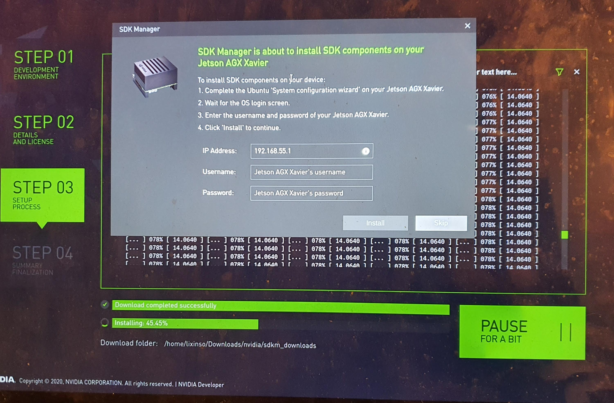
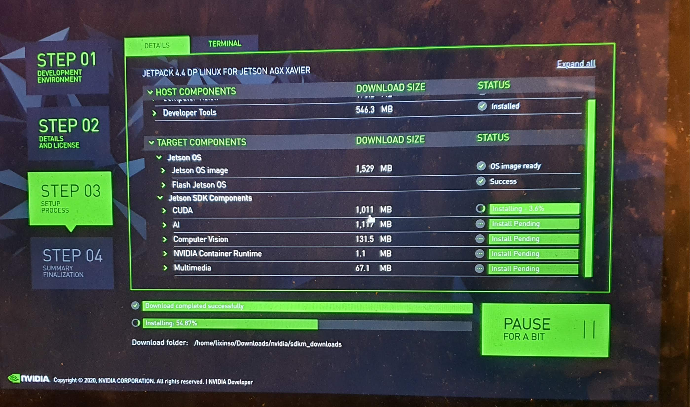

# Flash Jetson AGX Xavier Environment on Mac (Ubuntu 18 Dual System, not VM)

## Notes

Network not required.

SD Card not required

JetPack 4.4

## Steps

- Install Dual System (Ubuntu 18) on Macbook Pro.

- Install SDK Manager in host Ubuntu 18 

```
Download the NVIDIA SDK Manager to install JetPack.
https://developer.nvidia.com/nvsdk-manager

 $ sudo apt install ./sdkmanager-[version].[build#].deb 
($ sudo apt install ./sdkmanager_1.1.0-6343_amd64.deb)
```

- Remove SD Card from Jetson AGX Xavier if you have

- Connect USB-C to USB to Mac

```
- Verify with command $lsusb 
$ lsusb
......
Bus 001 Device 010: ID 0955:7019 NVidia Corp. 
......
```


- Recovery Mode

Connect Jetson AGX Xavier to Power, but power off.

    - Press and hold the middle (force recovery) button.
    - Press and hold the left (power) button.
    - Release both button.


- Manual Flush






# Notes

- If error says can't find python, then "apt install python" on host ubuntu.

# References

- https://www.youtube.com/watch?v=s1QDsa6SzuQ
- https://cudaeducation.com/jetsonxavier/
