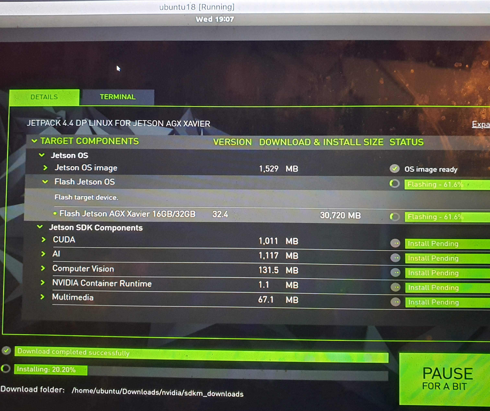

# Flash Jetson AGX Xavier Environment on Mac (Ubuntu 18 VM with Virtual Box)

Network not required.

SD Card not required

- Install Virtual Box on MacBook. Then Install Ubuntu 18 in it.

- Install SDK Manager in host Ubuntu 18 in VM

- Remove SD Card from Jetson AGX Xavier if you have

- Connect USB-C to USB to Mac

- Recovery Mode

Connect Jetson AGX Xavier to Power, but power off.

    - Press and hold the middle (force recovery) button.
    - Press and hold the left (power) button.
    - Release both button.

- Virtual Box Ubuntu 18 Configuration

Config the VM before power on VM.

- Manual Flush

