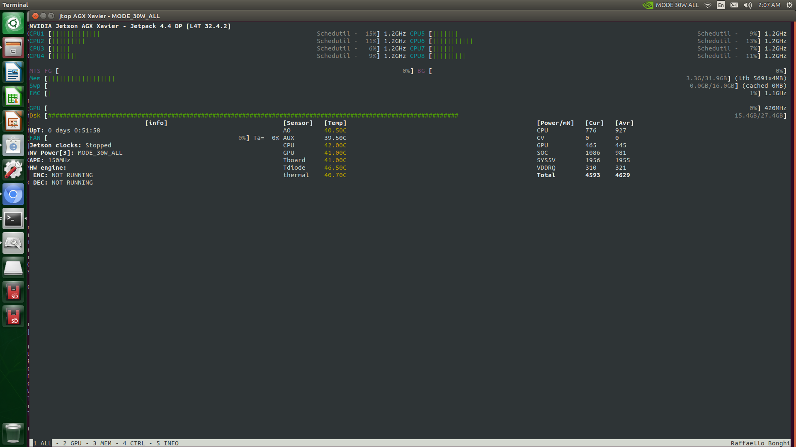

# Nvidia Jetson AGX Xavier (32G) Environment Setup

Flush system first. Working on the bare system with shipped hardware doesn't work well with nvidia docker.

After [Flush System](https://github.com/lixinso/jetson_agx_xavier_environment_setup/blob/master/FlashSystem.md)


## Hardware

Included in the package
- Board 
- Battery

Bring your own.
- WIFI  [Edimax EW-7811Un. This is one of the recommended by Nvidia](https://www.amazon.com/gp/product/B003MTTJOY/ref=ppx_yo_dt_b_asin_title_o04_s00?ie=UTF8&psc=1)
- SD Card [Samsung (MB-ME512GA/AM) 512GB 100MB/s (U3) MicroSDXC Evo Select Memory Card with Adapter
](https://www.amazon.com/gp/product/B07MKSGZM6/ref=ppx_yo_dt_b_asin_title_o01_s00?ie=UTF8&psc=1)

## Start Hardware

- Connect Power supply
- Connect Monitor with HDMI
- Connect USB-C to USB Cabel (in the package), extend with a USB hub (1 USB to 4 USB, bring your own)
- Connect WIFI Dongle on USB hub
- Connect USB Keyboard/Mouse on USB hub
- Power On

## Setup In host System
- Format SDCARD to FAT with UI (Disks) in the Nvidia Ubuntu system.  /data/ 100G (FAT), /data2/ 400G (Ext4)

### Setup to monitor host GPU

```
$ sudo apt install python3-pip
$ sudo pip3 install jetson-stats
$ jtop
```




## Test Environment

```
$ nvcc --version

nvcc: NVIDIA (R) Cuda compiler driver
Copyright (c) 2005-2019 NVIDIA Corporation
Built on Wed_Oct_23_21:14:42_PDT_2019
Cuda compilation tools, release 10.2, V10.2.89

$ sudo docker info | grep nvidia

Runtimes: nvidia runc
```

## Test Docker

```
docker pull nvcr.io/nvidia/l4t-ml:r32.4.2-py3
sudo docker run -it --rm --runtime nvidia --network host nvcr.io/nvidia/l4t-ml:r32.4.2-py3
```
