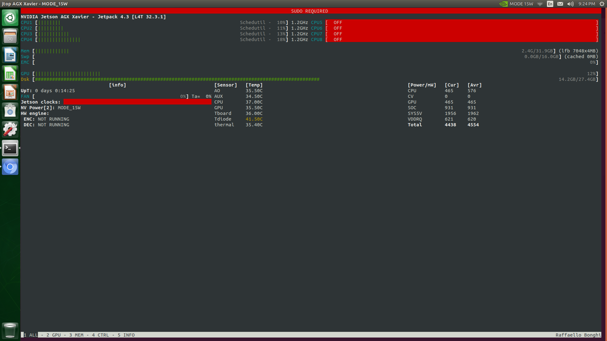

# Nvidia Jetson AGX Xavier (32G) Environment Setup
# (Based on the preinstalled system. GPU Docker doesn't work well eventually. Changed to flash from SDK Manager)

## Hardware

Included in the package
- Board (With System already installed)
- Battery

Bring your own.
- WIFI [EDUP Mini WiFi Dongle for pcDuino v1/Raspberry Pi
](https://www.amazon.com/gp/product/B00JXP7QAA/ref=ppx_yo_dt_b_search_asin_title?ie=UTF8&psc=1)  :Not the recommended one
- SD Card [Samsung (MB-ME512GA/AM) 512GB 100MB/s (U3) MicroSDXC Evo Select Memory Card with Adapter
](https://www.amazon.com/gp/product/B07MKSGZM6/ref=ppx_yo_dt_b_asin_title_o01_s00?ie=UTF8&psc=1)

## Start Hardware

- Connect Power supply
- Connect Monitor with HDMI
- Connect USB-C to USB Cabel (in the package), extend with a USB hub (1 USB to 4 USB, bring your own)
- Connect WIFI Dongle on USB hub
- Connect USB Keyboard/Mouse on USB hub
- Power On

## Setup In host System
- Format SDCARD to FAT with UI (Disks) in the Nvidia Ubuntu system.  /data/ 100G (FAT), /data2/ 400G (Ext4)

### Setup to monitor host GPU

```
$ sudo apt install python3-pip
$ sudo pip3 install jetson-stats
$ jtop
```




### Set host software

```
#apt install cuda-nvcc-10-0
#apt install cuda-toolkit-10-0


#wget https://nvidia.box.com/shared/static/c3d7vm4gcs9m728j6o5vjay2jdedqb55.whl
#mv c3d7vm4gcs9m728j6o5vjay2jdedqb55.whl torch-1.4.0-cp36-cp36m-linux_aarch64.whl
#apt install libopenblas-base
#pip3 install Cython
#pip3 install numpy torch-1.4.0-cp36-cp36m-linux_aarch64.whl 

>>> import torch
Traceback (most recent call last):
  File "<stdin>", line 1, in <module>
  File "/usr/local/lib/python3.6/dist-packages/torch/__init__.py", line 81, in <module>
    from torch._C import *
ImportError: libcudart.so.10.2: cannot open shared object file: No such file or directory


```

### Test Docker

```

#apt install nvidia-docker2
#apt install nvidia-container-runtime
#apt install -y nvidia-container-toolkit
#systemctl restart docker

# sudo docker info | grep nvidia
Runtimes: nvidia runc

docker pull nvcr.io/nvidia/l4t-ml:r32.4.2-py3
sudo docker run -it --rm --runtime nvidia --network host nvcr.io/nvidia/l4t-ml:r32.4.2-py3

```

### Fix WIFI
echo "blacklist rtl8192cu" | sudo tee -a /etc/modprobe.d/blacklist.conf

### Fix Remote Desktop Share

https://medium.com/@bharathsudharsan023/jetson-nano-remote-vnc-access-d1e71c82492b


## RUN Docker Environment

```
bash script_run_docker_locally.jetsonagx.sh
```


# References
- https://developer.nvidia.com/embedded/jetson-agx-xavier-developer-kit#resources
- https://developer.nvidia.com/embedded/dlc/jetson-agx-xavier-developer-kit-user-guide
- https://developer.nvidia.com/embedded/jetpack
- https://github.com/NVIDIA/nvidia-docker/wiki/NVIDIA-Container-Runtime-on-Jetson
- https://github.com/NVIDIA/nvidia-docker
- https://ngc.nvidia.com/catalog/containers/nvidia:l4t-pytorch
- https://gist.github.com/ShreyasSkandan/69f727d48f85d34e0e9b26308ade0040
- https://elinux.org/Jetson_Zoo#PyTorch_.28Caffe2.29
- https://docs.nvidia.com/jetson/index.html
- https://docs.nvidia.com/sdk-manager/download-run-sdkm/index.html
